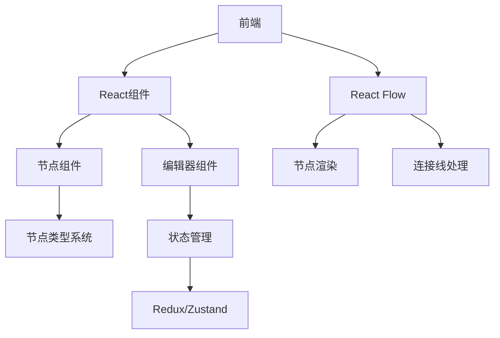

# 工作流编辑器核心原理

## 1. 系统架构

## 2. 关键组件

### 2.1 节点系统
- 基于React组件实现
- 每种节点类型对应独立组件
- 通过props传递节点数据

### 2.2 状态管理
- 使用Zustand管理全局状态
- 包含工作流数据、UI状态等
- 支持撤销/重做功能

### 2.3 数据流
1. 用户操作触发事件
2. 更新状态存储
3. React Flow同步渲染
4. 组件响应状态变化

## 3. 核心技术

### 3.1 节点连接
- 基于React Flow的连接系统
- 使用自定义边组件处理逻辑
- 连接验证机制

### 3.2 持久化
- 工作流保存为JSON格式
- 包含节点数据和连接关系
- 支持版本兼容处理

## 4. 性能优化

### 4.1 虚拟滚动
- 大工作流性能优化
- 仅渲染可视区域节点

### 4.2 批量更新
- 减少不必要的重渲染
- 使用React.memo优化
